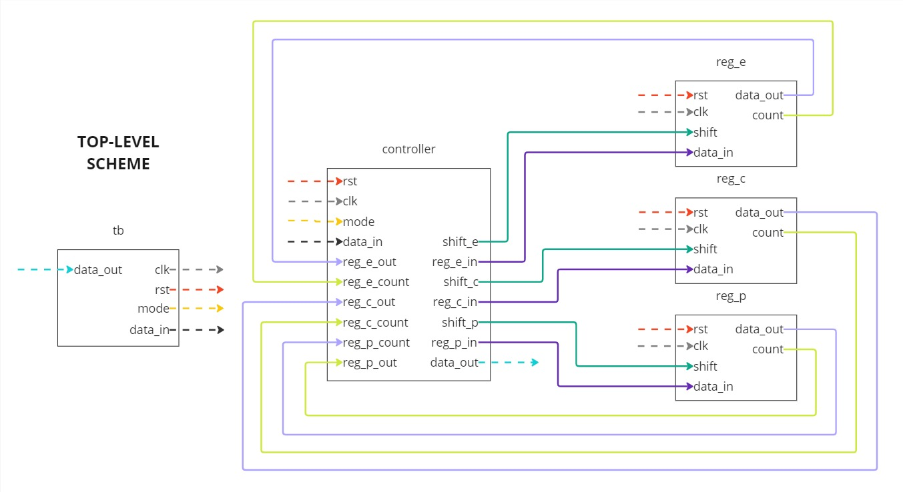
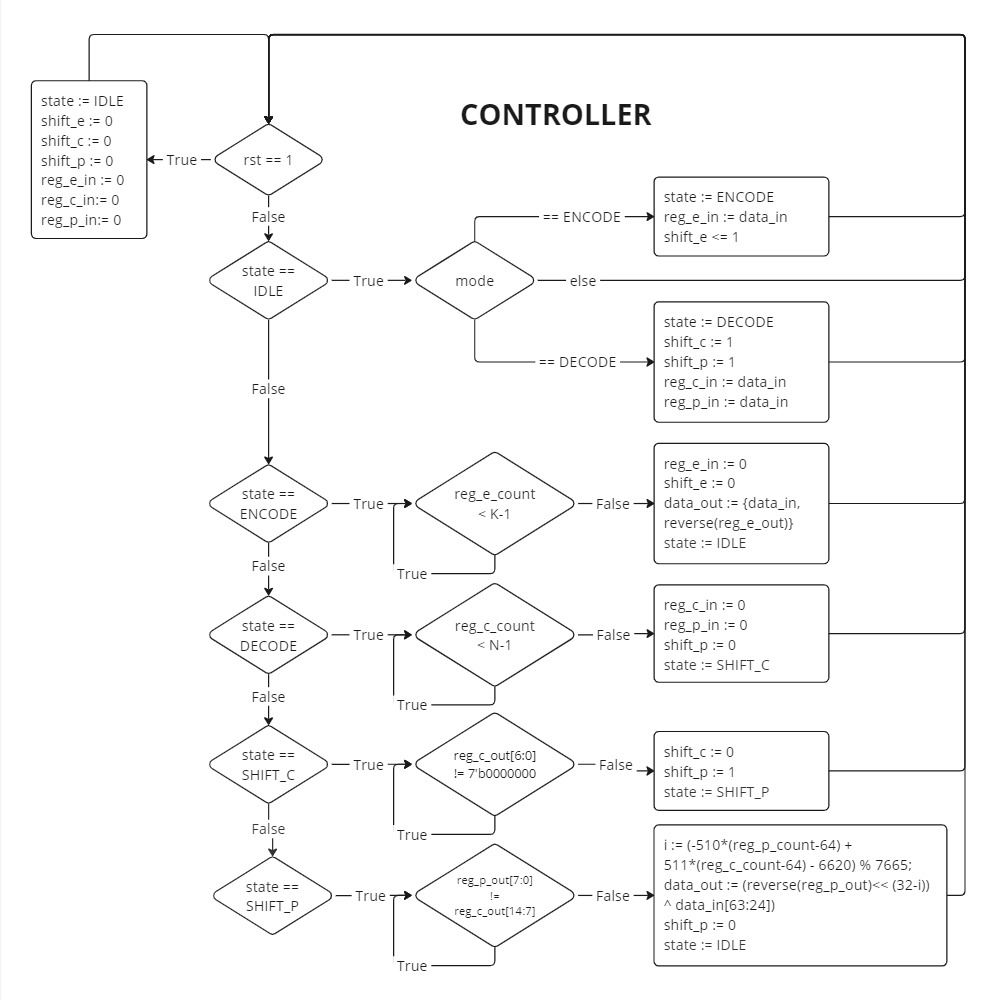
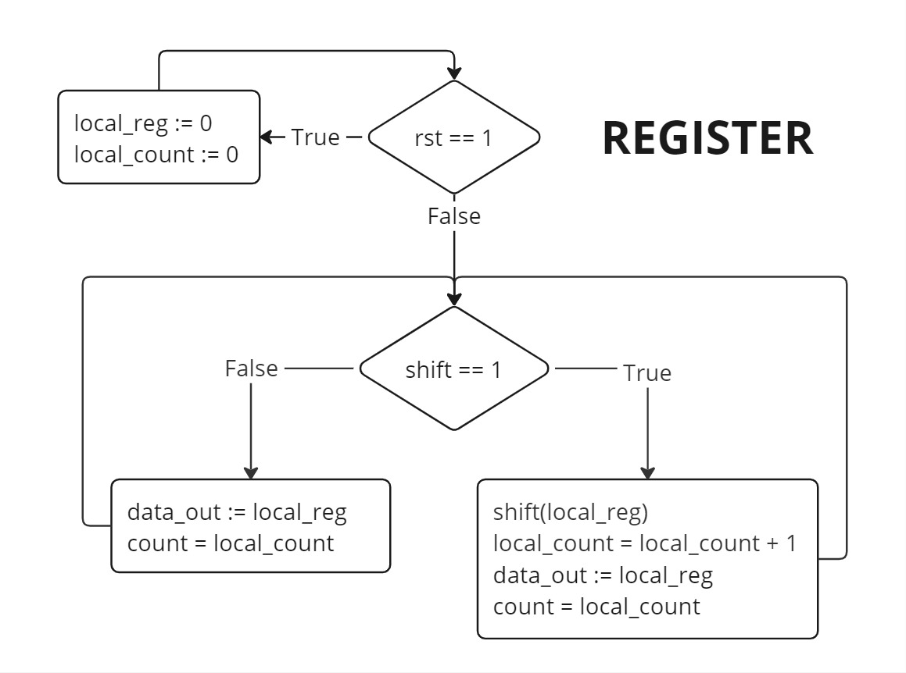
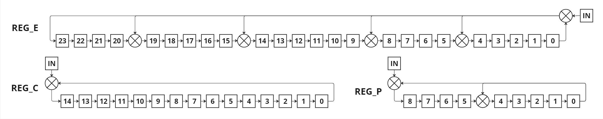
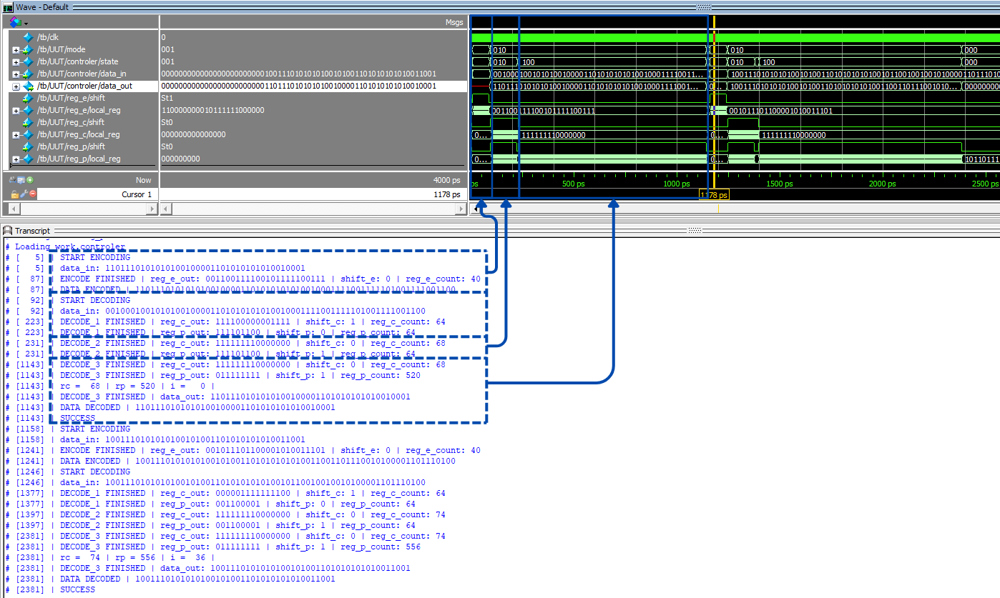

# Fire Code (64, 40) implementation
## Project objective
Goal of this project is implementation of Fire Code into physical system. This project consists of 3 parts: python prototype, modelsim simulation and quartus implementation. Each part is stored in an appropriately named folder.

## Python prototype
This prototype is based on example of single-burst-error correction code, mentioned in book [Error Control Coding: Fundamentals and Applications by Shu Lin](https://pg024ec.files.wordpress.com/2013/09/error-control-coding-by-shu-lin.pdf) (page 267). If you encounter problems understanding it, I encourage you to follow my research:
* [Error Control Coding: Fundamentals and Applications by Shu Lin](https://pg024ec.files.wordpress.com/2013/09/error-control-coding-by-shu-lin.pdf)
    * chapter 4.1, 4, 5, 7
    * chapter 5.1
    * chapter 9.1, 2, 3
* [Augmented Burst-Error Correction For Unicon Laser Memory](https://ntrs.nasa.gov/api/citations/19750017564/downloads/19750017564.pdf)
    * Pages 5-12
    * Appendix

### Main function
Responsible for running the whole simulation. It is possible to test it manually or automatically by changing the commented code. 
* n - Length of codeword.
* k - Length of message.
* el - Position of error. You can change it by changing the subtrahend.
* e - Pattern of error. It's shifted n-times left to adjust position.
* m - Message inserted into the encoder.
* g - Coding polynomial. The binary value is set of coefficients of this polynomial expansion.
* em - Encoded message (overall input).
* rm - Recived message. Result of applying error on encoded message.
* rc - Variable used in the calculation of l. Result of shifting error-pattern register. Represents number of shifts required to achive zeros in 7 high-order bit positions.
* rp - Variable used in the calculation of l. Result of shifting error-location register. Represents number of shifts required to achive error pattern.
* i - Predicted position of error. Calculated on the basis of rc, rp and two coefficients characteristic for g(x). Learn more on [page 268](https://pg024ec.files.wordpress.com/2013/09/error-control-coding-by-shu-lin.pdf) and [page 12](https://ntrs.nasa.gov/api/citations/19750017564/downloads/19750017564.pdf)
* cm - Corrected message (overall output).

### Test function
Using subprocess library, it runs main function user-specified number of times, taking random error location, error pattern and message from generator function. Then it saves the results returned by main.py in json format to output.txt file, where user can analyse them.

### Other functions
* Encoder - Takes message (int m). Returns encoded message (int em).
* Cregister - Simulates error-pattern register. Takes recived message (int rm). Returns error pattern (int ep) and required number of shifts (int rc).
* Pregister - Simulates error-location register. Takes recived message (int rm) and error pattern (int ep). Returns required number of shifts (int rp).
* Corrector - Simulates last operation on scheme, which is error correction. Takes recived message (int rm), error pattern (int ep) and calculated l (int l). Returns corrected message (int cm).
* Color - Just for easier coloring of results. Takes int and positions of red and yellow markers. Returns string with coloring.
* Generator - generates random inputs for main function
* Test - runs main function several times and writes outputs to a text file

## Modelsim simulation
Folder contains Verilog files. It can be tested in modelsim with test.do script. The following are schematics and diagrams describing the system presented.

## Quartus implementation
The following is the result of compilation in the Quartus environment.
